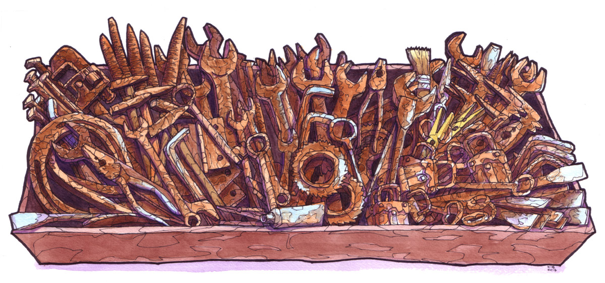
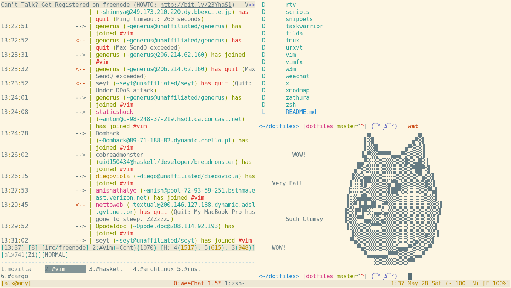

# Dotfiles

### About

Daniel Campoverde Carrión [alx741]

mailto: <alx@sillybytes.net>

GPG key id: 12622B78 (keys.gnupg.net)

http: [Silly Bytes](http://www.sillybytes.net)

License: https://github.com/alx741/dotfiles/blob/master/LICENSE.md

Using [Solarized](http://ethanschoonover.com/solarized) Light color scheme.

### Dotfiles

* Astyle
* Avrdude
* Ccze
* Ctags
* Ghci
* Gimp
* Git
* Gpg
* Gtk
* Haskeline
* Hindent
* Inkscape
* Kitty
* Mimi
* MongoDB
* Mozrepl
* Mpd
* Mplayer
* Mpv
* Mutt
* MySQL/MariaDB
* Ncmpcpp
* NeoVim
* Nethack
* Newsbeuter
* Nitrogen
* Npm
* Octave
* Odyssey
* Openbox
* Pacman
* PostgreSQL
* Ratpoison
* Readline
* Rofi
* Rtv
* Sshrc
* Stack
* Stylish-haskell
* Sxiv
* Systemd
* Taskwarrior
* Tmux
* Urxvt
* Vim
* VimFx
* Vimium
* Vimperator
* Vmenu
* W3M
* Weechat
* X11
* Xmodmap
* Xmonad
* Zathura
* Zsh

#### Deprecated

These dotfiles are abandoned

* ~~Apvlv~~
* ~~Dwm~~
* ~~Emacs~~
* ~~Tilda~~

### Installation

    $ stow -t ~ vim
