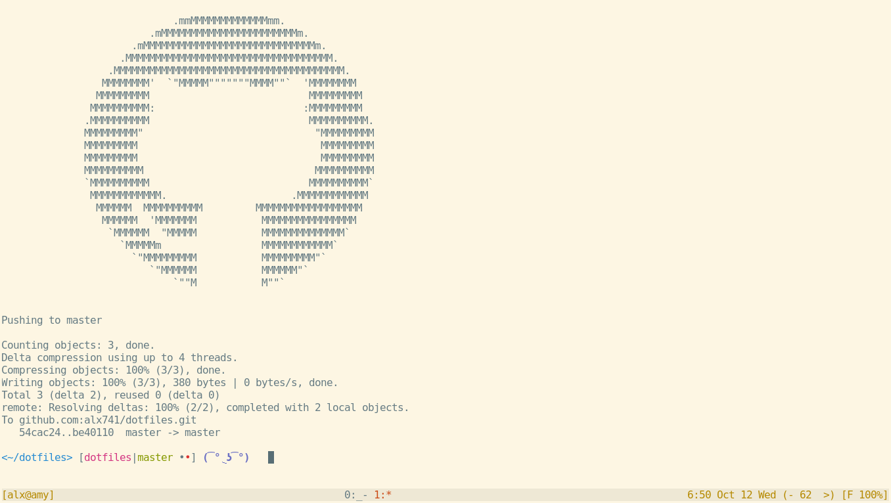
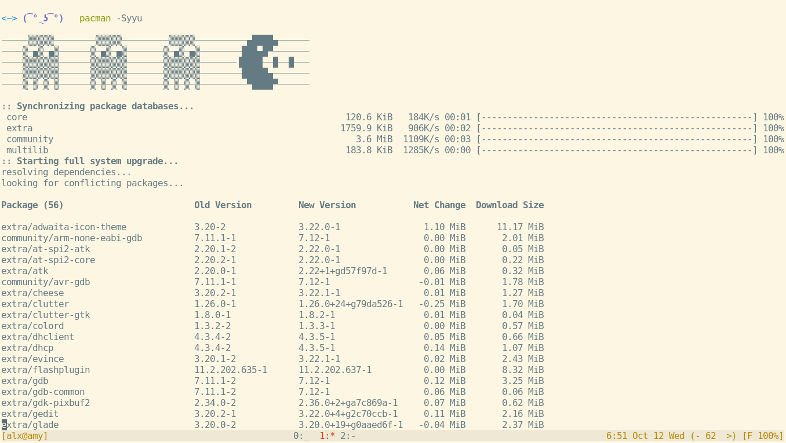
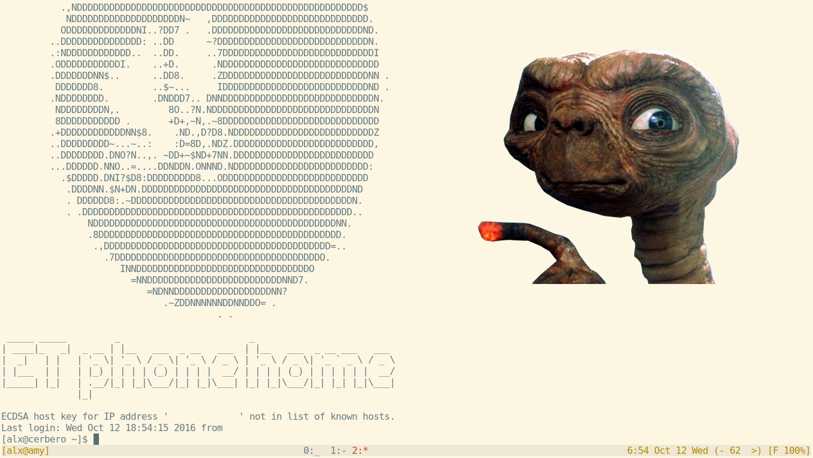

# Dotfiles

## About

Daniel Campoverde Carrión [alx741]

mailto: <alx@sillybytes.net>

GPG key id: 12622B78 (keys.gnupg.net)

http: [Silly Bytes](http://www.sillybytes.net)

License: https://github.com/alx741/dotfiles/blob/master/LICENSE.md

Using [Solarized](http://ethanschoonover.com/solarized) Light color scheme.

## Installation

Use GNU `stow` to install each config like this:

        $ stow -t ~ vim

## Show me

Here is my *urxvt* emulator running *tmux*, *zsh* and *weechat*

Here a *vim* instance with my *.vimrc* and a Haskell *GHCI* session

And over here a *git* push and a *pacman* update

Oh! And here a *ssh* session to my home lab network. "ET phone home"... Got it?

## Dotfiles

* Astyle
* Avrdude
* Ccze
* Ctags
* Ghci
* Gimp
* Git
* Gpg
* Gtk
* Haskeline
* Hindent
* Inkscape
* Mimi
* MongoDB
* Mozrepl
* Mpd
* Mplayer
* Mpv
* Mutt
* MySQL/MariaDB
* Ncmpcpp
* NeoVim
* Nethack
* Newsbeuter
* Nitrogen
* Npm
* Odyssey
* Openbox
* Pacman
* PostgreSQL
* Ratpoison
* Readline
* Rtv
* Stack
* Sxiv
* Systemd
* Taskwarrior
* Tmux
* Urxvt
* Vim
* VimFx
* Vimperator
* Vmenu
* W3M
* Weechat
* X11
* Xmodmap
* Xmonad
* Zathura
* Zsh

### Deprecated

These dotfiles are abandoned

* ~~Apvlv~~
* ~~Dwm~~
* ~~Emacs~~
* ~~Tilda~~

## Dependencies

These dotfiles depends, obviously, on the all the programs it configures, so
install them first.

Some of the various scripts depend on other binaries that can be installed using
the system package manager. This is a non-exhaustive list:

* acpi
* alsa-utils
* ccze
* dhclient
* diff-so-fancy
* expect
* figlet
* firefox
* hsColour
* id3v2
* lolcat
* mpc
* qrencode
* scrot
* task
* unclutter
* vmenu
* xcape
* xclip
* xcowsay
* xdotool
* youtube-dl
